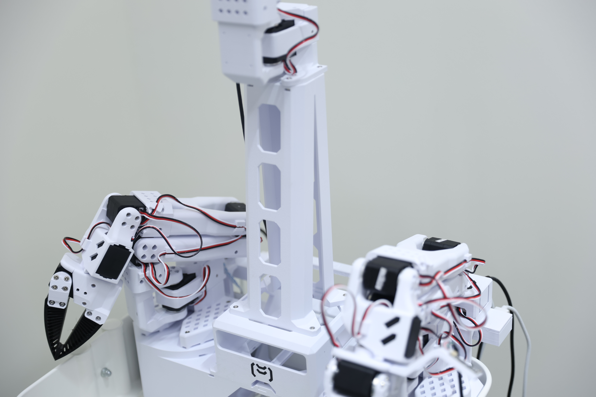
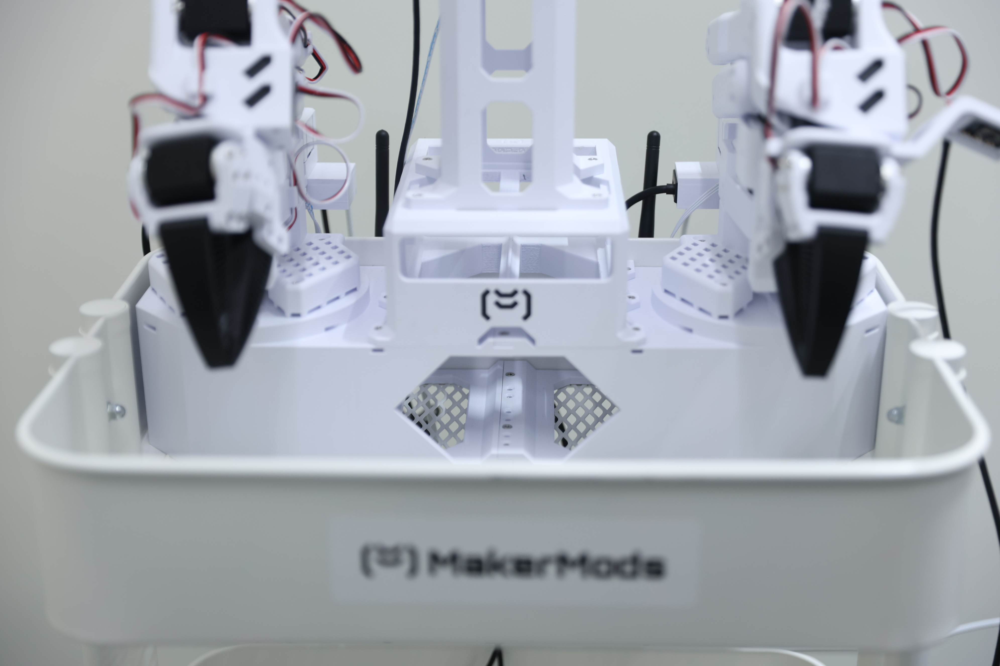
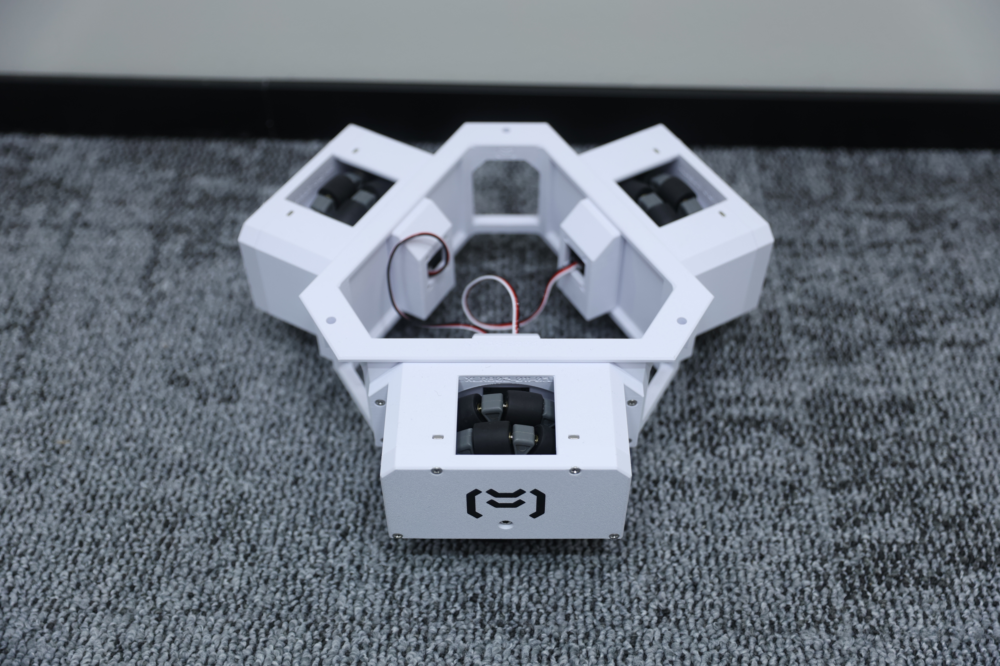
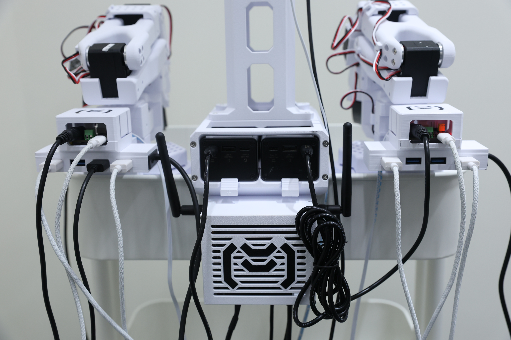
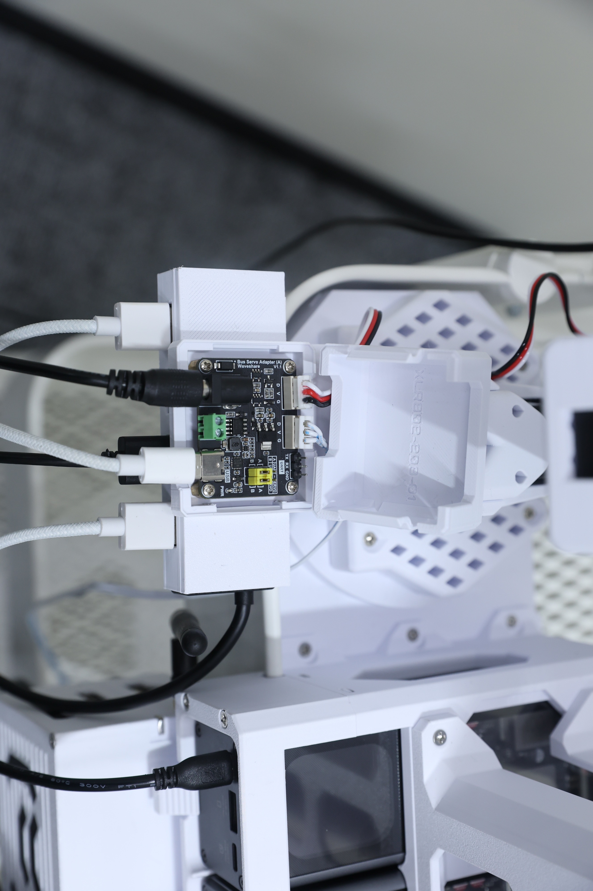
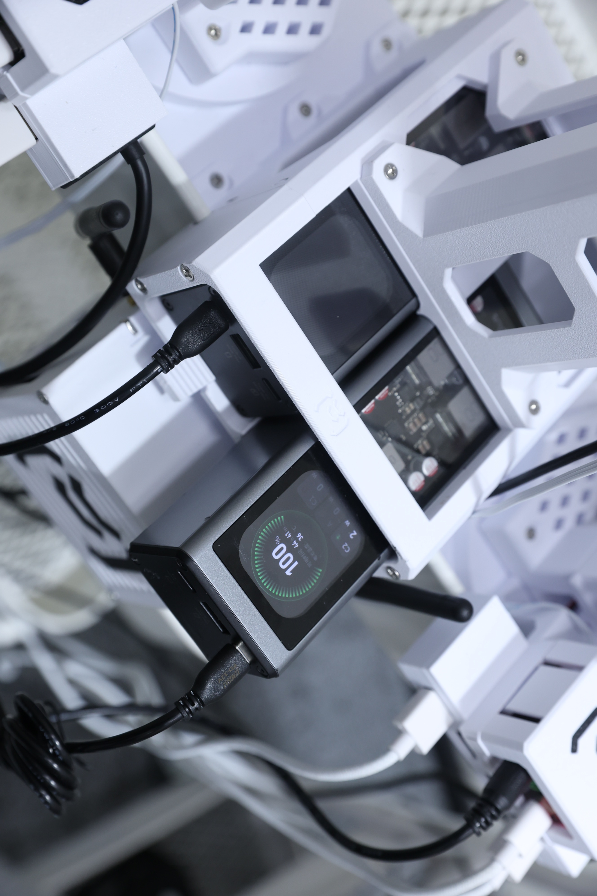
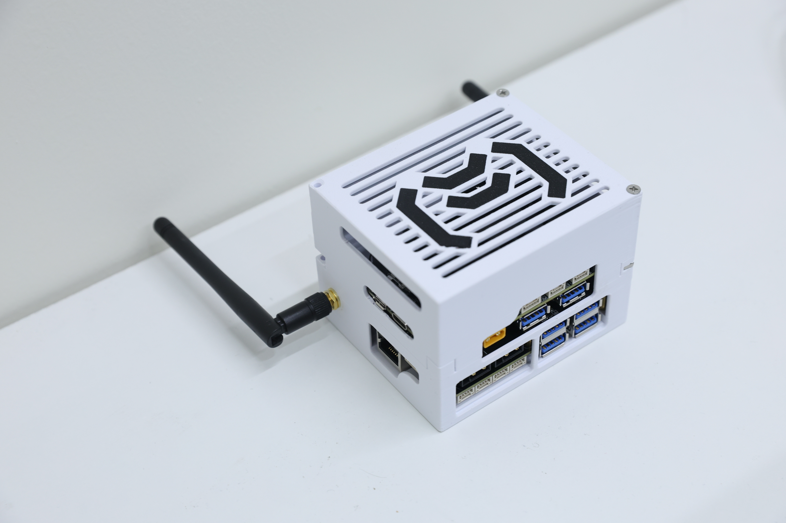

# XLeRobot 硬件升级版 - 由 MakerMods 提供

**重新设计的 3D 打印结构、更强固的轮式底盘、快拆式电源支架以及整洁的电子设备布线方案**，专为 [XLeRobot](https://github.com/Vector-Wangel/XLeRobot) 双臂移动机器人打造。

本升级版与 [LeRobot](https://github.com/huggingface/lerobot) 完全兼容，**无需修改任何软件代码**。

由 [MakerMods](https://makermods.ai) 与 XLeRobot 原作者 Vector Wang 合作开发。您可以从 [makermods.ai](https://makermods.ai/xlerobot) 购买**预组装成品**或**精选套件**（即将推出）。

  
  
<em>MakerMods 升级版 XLeRobot 正在执行双臂取放任务</em>

### 项目亮点

- **重新设计的结构件** —— 包括两段式颈部、带轴承支撑的轮组模块、快拆式移动电源支架、集成的集线器（Hub）及驱动板外壳。仅保留了原版的头部和 SO-101 机械臂舵机支座。
- **经过打印验证的 `.3mf` 文件** —— 提供一个完整的 Bambu Studio 项目文件（适配 P1S / P2S / H2S / H2D 等机型，使用 Esun PLA+），包含标注清晰的打印板、支撑和工艺设置 —— 这与我们内部生产使用的文件完全一致。
- **黑客松实战验证** —— 在深圳举办的 MakerMods Physical AI x OpenClaw 黑客松中，现场部署了 **25 台升级版 XLeRobot** 供参赛者使用，所有设备在整个活动期间运行稳定。
- **成品或 DIY 可选** —— **成品**可节省约两天的组装时间，收货后仅需运行我们的**自动校准脚本**。使用精选零件的**套件**即将推出 —— 详见[购买预组装成品](#购买预组装成品)。
- **原生支持 [XLeRobot](https://github.com/Vector-Wangel/XLeRobot) 和 [LeRobot](https://github.com/huggingface/lerobot)** —— 直接克隆现有仓库并遵循其设置指南即可；无需 Fork、无需补丁，也无需自定义固件。
- **更新动态** —— 访问 [makermods.ai](https://makermods.ai) 或加入 [Discord](https://discord.gg/pKsm95Qt) 获取套件新闻和技术支持。

---

## 购买预组装成品

想要让您的 XLeRobot **跳过约两天的机械组装过程直接运行**吗？MakerMods 提供**成品机**销售，让您可以比从零开始 DIY 更快地进入调试、软件开发和实验阶段。

**关于校准：** 我们**不**宣称“开箱即用且完全校准”。拆封后，您需要运行我们的**自动校准**工作流（脚本）—— 该设计旨在让您在工作台上能快速且重复地完成校准。

**[在 makermods.ai/xlerobot 购买预组装成品 -->](https://makermods.ai/xlerobot)**

> **套件（即将推出）：** 如果您**享受组装过程**，我们即将在 [makermods.ai](https://makermods.ai) 上推出**套件**。它采用 MakerMods 精选组件，确保零件质量，为您节省逐一寻找物料清单（BOM）的时间。

---

## 演示视频

**黑客松实战：深圳 Physical AI X OpenClaw 黑客松现场的 25 台升级版 XLeRobot**

  
  
<em>获得 NVIDIA x Hugging Face x Seeed Studio 深圳黑客松三等奖</em>

**系统演示**

  <table>
    <tr>
      <td align="center" width="33%">
        
        
<em>双臂协同操作</em>

      </td>
      <td align="center" width="33%">
        
        
<em>自主执行（侧视图）</em>

      </td>
      <td align="center" width="33%">
        
        
<em>自主执行任务</em>

      </td>
    </tr>
  </table>

---

## 机械设计升级详情

本节涵盖了**硬件改动**：我们在 CAD 中针对原版 XLeRobot 结构做了哪些重新设计，以及**为什么它们更易于打印、安装和维护**。此处所有的改动均为**机械结构**（打印件、支架、外壳）。您可以直接使用 [XLeRobot](https://github.com/Vector-Wangel/XLeRobot) 和 [LeRobot](https://github.com/huggingface/lerobot) 官方仓库 —— 软件端无需任何改动。

### 打印验证的 `.3mf` 文件

我们提供了一个经过完整打印验证的 Bambu Studio 项目文件：**[`3mf/MakerMods XLeRobot Upgrade PLA+ P2S.3mf`](./3mf/MakerMods%20XLeRobot%20Upgrade%20PLA%2B%20P2S.3mf)**

  

- **测试机型：** Bambu Lab **P1S**, **P2S**, **H2S**, 以及 **H2D**
- **耗材建议：** 结构件使用 [Esun PLA+](https://www.esun3d.com/epla-product/)；夹持器部分使用 **Bambu Lab TPU 90A**
- 所有打印板、支撑和工艺设置均已预配置 —— 与我们内部生产使用的设置完全一致。

**原版 vs 重新设计：** 只有**头部的舵机支架**和**两条 SO-101 臂上的舵机支架**保留了原版设计。我们发布版本中**所有其他结构打印件** —— 包括颈部、宜家（IKEA）推车适配件、可驱动轮式底盘、集线器与驱动板支架、**快拆式双移动电源支架**（位于颈部下方）以及外壳等 —— 均由 **MakerMods 重新设计**。

### 两段式颈部（优化打印成功率）

我们将颈部**拆分为两个打印件**，使得每个部件在常见的 FDM 打印机上都**更容易定向并成功打印**（减少了单体超高件的打印风险）。

  

### SO-101 臂架、宜家推车与方螺母槽

**大号宜家（IKEA）手推车**是机器人的**主移动结构** —— 可以将其视为承载一切的**身体**。我们重新设计了 **SO-101 机械臂的安装座**，使其能干净利落地固定在推车上，比临时搭建的支架方案更容易对齐。

**方螺母槽 (Nut Traps)：** 所有的**六角螺母槽都改成了方螺母槽**。螺母从侧面滑入槽位。在**拆卸**关节或支架时，**嵌入式方螺母不会像六角螺母那样掉出来** —— 这在您调整布线、更换零件或运输机器人时能极大提升迭代效率。

  

### 驱动底盘（轮组模块 + 轴承）

**宜家推车的底部**是**动力系统**所在地。

**对比原版的改进：** 原版的宜家推车配置使用 LeKewi 底盘作为参考。实际使用中，每个轮子实际上仅由单侧支撑：舵机驱动侧承受了所有载荷，而另一侧仅是轮毂圆环，没有对侧支撑。这会导致组件产生**倾斜和晃动** —— 尤其是在 XLeRobot 的满载重量下。这种不对称性表现为**抖动**、接触不均匀以及底盘刚性不足。

**我们的改动：** 我们将**每个轮子视为独立的模块**。一侧保留驱动舵机；**另一侧增加了轴承支持**，使轴心实现**双侧支撑**。载荷由**舵机 + 轴承**共同分担，轮子能保持与地面垂直，推车在承载 XLeRobot 重量时不会再出现旧版的单侧悬臂形变。

  

### USB 集线器支架

我们在**每个驱动板下方增加了两个 USB 集线器（Hub）支架**，方便将所有 USB 线缆集中插入。支架将所有接口朝外放置以便插拔，线缆从背面整齐退出，避免线缆杂乱交织。

  

### 控制板安装架与驱动器外壳

每个总线舵机驱动板都安装在带有**按扣盖**的专用架上。只需挤压两侧即可弹出盖子以操作线缆；按下即可保护电路板。无需工具，无需螺丝。

  

### 双移动电源快拆支架（颈部下方）

**颈部正下方**结构包含一个**快拆摇篮，可容纳两个 Lenovo Fluxo 140 W USB-PD 移动电源**（详见 [物料清单](#物料清单)）。电源**放入即可固定**，并通过一个**弹性按压卡扣**锁定 —— 在现场需要**更换或充电**时无需寻找螺丝。它能保持两个单元与**布线计划**对齐，控制 USB-C 线缆的弯折和接头受力。

  

### 计算单元外壳 (Jetson Nano)

为**车载计算单元**（**NVIDIA Jetson Nano + SSD + 扩展口帽升级件**）设计的可打印壳体，确保计算模块不会裸露并在推车上四处滑动。

  

### 升级项一览（快速扫描）

| 区域 | 改动项 (单行概述) |
| ---- | ------------------------ |
| 颈部 | **两段式打印件**，优化 FDM 打印成功率 |
| SO-101 + 宜家推车 | 专为**推车框架**设计的**臂架**；**侧入式方螺母槽**（螺母不再脱落） |
| 推车底部 / 轮组 | **单轮模块化**：**舵机 + 对侧轴承**（取代不对称的 **LeKewi** 式支撑） |
| USB 集线器 | **专用支架**，缩短线缆路径，更安全 |
| 驱动板 | **安装架 + 外壳**，走线更整洁 |
| 电源 | 颈部下方**快拆支架**，适配 **2x Lenovo Fluxo 140 W**；带**弹性卡扣** |
| 计算单元 | **Jetson Nano** 可打印保护壳 |

---

## 原版 vs 本仓库

| 主题 | 原版 XLeRobot (基准) | 本仓库 (MakerMods 硬件刷新) |
| ----- | ---------------------------- | --------------------------------------------- |
| 您将获得 | 参考机器人设计、软件和社区 BOM 路径 | **替换/增补的 3D 打印零件**、支架及外壳（适配相同软件栈） |
| 打印件范围 | 大部分为原版 STL | **保留：** 仅头部 + **两个 SO-101 臂**舵机座。**重构：** 所有其他结构件 —— 附带**单文件打印验证的 `.3mf`** |
| 机械结构封装 | 社区基准 CAD | **两段式颈部**；适配**宜家推车**的 **SO-101 支架**；**侧入式方螺母槽**；**轴承支撑的轮组模块**；**Hub + 驱动板**支架与外壳 |
| 现场供电 | 根据社区 BOM 自选 | 颈部下方的 **2× Lenovo Fluxo 140 W 快拆支架**（带**弹性卡扣**）+ 适配打印布局的布线 |
| USB / 驱动板 | 用户自行布局 | **Hub + 驱动板支架/外壳**，实现标准化安装 |
| 计算单元 | 用户自理 | **Jetson Nano** 可打印保护壳 |

---

## 技术规格 (基于此物料清单配置)

以下数据**基于本仓库的 BOM 快照**；机械臂运动学、负载和具体的自由度（DOF）遵循原版 XLeRobot —— 详见原版文档。

| 项目 | 详情 |
| ---- | ------- |
| 软件兼容性 | 直接使用 [XLeRobot](https://github.com/Vector-Wangel/XLeRobot) 和 [LeRobot](https://github.com/huggingface/lerobot) —— 无需 Fork 或修改 |
| 摄像头 | **腕部和头部使用相同的摄像头模块**（共两个）。使用同型号摄像头可**降低成本**，且在我们的实际测试中，**感知质量依然强劲**。 |
| 舵机 | **17x** 12V + **12x** 7.4V 总线舵机 (按 BOM) |
| 电源 | **2x** Lenovo **Fluxo** **140 W** USB-PD 移动电源 (按 BOM) |
| 移动底座 | 宜家 **大号** 手推车 + 脚轮 (按 BOM) |
| 自由度 / 臂展 / 负载 | 与您构建配置下的原版 XLeRobot 一致 —— 请查阅 [XLeRobot 文档](https://xlerobot.readthedocs.io/) |

---

## 软件兼容性

本硬件是原版打印/机械结构的**掉入式替换（Drop-in replacement）**。您可以按照文档说明安装并运行 [XLeRobot](https://github.com/Vector-Wangel/XLeRobot) 和 [LeRobot](https://github.com/huggingface/lerobot) —— 相同的设置步骤、相同的命令、相同的配置。无需 Fork、无需补丁、无需更改环境。

### LeRobot 集成

直接使用 [Hugging Face LeRobot](https://github.com/huggingface/lerobot) 仓库：使用与标准 XLeRobot 完全相同的工作流和脚本来训练、部署 VLA 策略、记录数据集并进行推理。

> **自动校准 PR (评审中)：** 我们已向 LeRobot 提交了一个 Pull Request，为所有 SO-101 类机械臂添加了**自动校准功能**：[huggingface/lerobot#3282](https://github.com/huggingface/lerobot/pull/3282)。如果您想配合 **LeRobot v0.5.0** 尝试，可以直接切到该分支。一旦合并，包括 XLeRobot 在内的所有 SO-101 用户都能获得更简洁、可重复的校准体验。

### 支持的控制模式

| 模式 | 描述 |
| ---- | ----------- |
| VR 控制 | 通过 [XLeVR](https://xlerobot.readthedocs.io/en/latest/simulation/getting_started/vr_sim.html) 进行 Quest 3 遥操作 |
| Xbox 手柄 | 无线 Xbox 手柄遥操作 |
| Switch Joy-Con | 任天堂 Switch Joy-Con 控制 |
| 键盘控制 | 直接通过键盘遥操作 |
| 仿真模拟 | 完整的 MuJoCo 仿真支持 |
| 网页控制 | 基于浏览器的控制界面 |

---

## 快速上手 (首个 30 分钟)

目标：完成**遥操作或仿真运行**，而不仅仅是克隆仓库。

1. **选择您的路径**
   - **DIY:** 从 [`/3mf`](./3mf) 目录下的 **master `.3mf`** 进行切片和打印（Bambu **H2S / P2S**, **Esun PLA+** —— 详见 [3D 打印零件](#3d-打印零件)），采购 [BOM](#物料清单) 零件并组装。
   - **快速路径:** [购买预组装成品](https://makermods.ai/xlerobot) 并跳过约 **两天** 的组装时间；然后运行我们的脚本进行 **自动校准**。
2. **准备工作站** —— 根据原版文档准备 Ubuntu 或 macOS；仿真可选 GPU，本地训练则必须配备 GPU。
3. **安装 XLeRobot 软件** —— 克隆 [XLeRobot 仓库](https://github.com/Vector-Wangel/XLeRobot) 并遵循其 [文档](https://xlerobot.readthedocs.io/) 进行环境配置。本升级硬件无需额外软件步骤。
4. **连接硬件 (实体机器人)** —— 根据接线清单连接电源、USB 集线器和舵机总线；在第一次动作前固定好所有受力线缆。
5. **校准** —— 运行原版的校准 / 遥操作流程。对于 **SO-101 + LeRobot**，详见上文提到的 [LeRobot 集成](#lerobot-集成) 挂起 PR。
6. **初次动作** —— 使用任一 [支持的控制模式](#支持的控制模式) 启动 **仿真** 或 **硬件遥操作**。您应该能在一次 Session 内看到**关节受控移动**或**仿真状态更新**。
7. **可选步奏** —— 加入 [Discord](https://discord.gg/pKsm95Qt) 获取组装帮助和 MakerMods 更新动态。

---

## 物料清单 (BOM)

硬件组件列表（**不含计算单元及运费**）。
`Actual Used Qty` 为单台构建消耗量。`Minimum Buyable Qty` 为建议的最小采购单位。

**摄像头：** **头部**和**腕部**使用**完全相同的摄像头模块** —— 您总共需要 **两个**。这能让 BOM 更简单、成本更低，且在实际使用中**未发现兼容性问题**。

| 项目 | 实际用量 | 最小购买量 |
| ---- | --------------- | ------------------- |
| Esun PLA+ 耗材 | 3900 g | 4 卷 |
| TPU 90A 耗材 | 40 g | 1 卷 |
| 3M 抓地材料 | 256 mm | 1000 mm |
| 12V 舵机 | 17 个 | 17 个 |
| 7.4V 舵机 | 12 个 | 12 个 |
| Lenovo Fluxo 移动电源 (140 W USB-PD) | 2 个 | 2 个 |
| 总线舵机驱动板 | 4 块 | 4 块 |
| 100 cm 舵机 3-pin 线缆 | 2 根 | 2 根 |
| USB 集线器 | 2 个 | 2 个 |
| USB-C 线缆 | 4 根 | 4 根 |
| 12V 3A Type-C 转 PD 诱骗线 | 3 根 | 3 根 |
| 12V DC 电源线 | 2 根 | 2 根 |
| 7.4V DC 电源线 | 2 根 | 2 根 |
| 摄像头模块 (腕部头部通用，带连接线) | 2 个 | 2 个 |
| 宜家大号手推车 | 1 套 | 1 套 |
| 脚轮 (不含联轴器) | 3 个 | 3 个 |
| 螺丝与螺母 (M3 系列) | 1 套 | 1 套 |

**DIY 材料估算总价：** 我们尚未核实最新的零件价格，但 Vector Wang 最初对 XLeRobot 的估算约为 **~$600 USD**（不含计算单元、移动电源、3M 胶带、TPU 夹爪、USB Hub、组装成本及运费）。请注意，自该估算以来 **飞特 (Feetech) 舵机价格有所上涨**，实际总价可能会更高。

---

### 3D 打印零件

**推荐使用主 `.3mf` 文件。** 我们在 [`/3mf`](./3mf) 目录中提供了一个 **Bambu Studio 项目**，该文件已在 **Bambu Lab P1S, P2S, H2S, 和 H2D** 上通过验证 —— 与我们内部生产使用的文件完全一致。它包含**所有重新设计的结构件**以及**原版的头部和 SO-101 舵机座**，采用标注清晰的打印板组织，并预设了**支撑和工艺参数**。

**耗材建议：** 结构件使用 **Esun PLA+**；夹持器使用 **Bambu Lab TPU 90A**。

**其他格式：** 独立的 **STL** 文件即将推出。

#### 计算单元外壳

| 外壳 | 用途 |
| --------- | -------- |
| NVIDIA Jetson Nano | 车载推理与控制 |

---

## 参与贡献

我们欢迎能改进实际构建体验的 **PR** 和 Issue：

- 组装文档、接线图及打印件小改动。
- 适配常见外设的新款**外壳**或安装板。
- 带有测试证据的集成笔记（摄像头、Hub、其他型号推车）。

对于较大的提议，请先在 **[Discord](https://discord.gg/pKsm95Qt)** 开启讨论，或在仓库提交 Issue。

---

## 关于 MakerMods

[MakerMods](https://makermods.ai) 致力于打造让机器人和具身智能触手可及的工具 —— 从**预组装机器人**和（即将推出的）**精选套件**，到**软件**和**社区**。

---

## 致谢

- [Ryan Chan](https://github.com/RyanResolutions) ([X](https://x.com/Ryan_Resolution)) —— 指导整体硬件升级设计；USB Hub 支架设计。
- [Thomas Lei](https://github.com/mrthompsonpro) —— 颈部机械设计、**宜家推车集成**（上层打印件及相关布局）、电源支架及 Jetson Nano 外壳设计 *(历史贡献；非现任维护)*。
- **Yuncheng Xu** —— 机械臂下方安装座及控制板外壳。
- [Vector Wang](https://github.com/Vector-Wangel) —— XLeRobot 原作者；本次升级的合作伙伴。
- [Isaac Sin](https://github.com/IsaacSinn) ([X](https://x.com/IsaacSin12)) —— 硬件输入与 MakerMods 软件开发。
- [Liu Qi](https://github.com/Lakesenberg) —— 硬件反馈。
- [XLeRobot](https://github.com/Vector-Wangel/XLeRobot) —— 软件及机器人基础。
- [LeRobot (Hugging Face)](https://github.com/huggingface/lerobot) —— 机器人框架。
- [SO-101](https://github.com/TheRobotStudio/SO-ARM100) —— XLeRobot 使用的机械臂血统。

### 维护者

活跃维护与产品咨询：**Ryan Chan** 和 **Isaac Sin** —— 详见[联系方式](#联系方式)和 [Discord](https://discord.gg/pKsm95Qt)。

---

## 开源协议

本项目采用 [MIT License](./LICENSE) 开源协议。

---

## 联系方式

- **网站:** [makermods.ai](https://makermods.ai)
- **邮箱:** [ryan@makermods.ai](mailto:ryan@makermods.ai), [isaac@makermods.ai](mailto:isaac@makermods.ai)
- **Discord:** [加入我们的社区](https://discord.gg/pKsm95Qt)
- **X (Twitter):** [@Ryan_Resolution](https://x.com/Ryan_Resolution), [@IsaacSin12](https://x.com/IsaacSin12)
